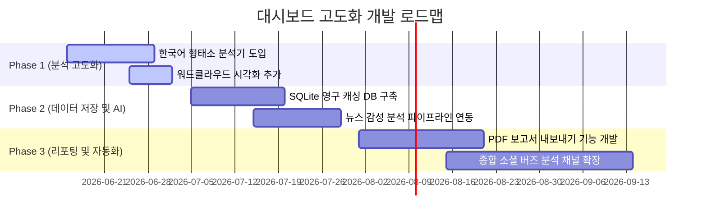

# 📝 네이버 API 대시보드 개선 마스터 플랜

이 문서는 네이버 API 통합 분석 대시보드([naver-api-app](file:///Users/corazzon/work/icb10proj2/naver-api-app))의 사용성과 시각적 가독성, 그리고 기능 고도화를 위한 기획자 및 UX/UI 리서처의 분석 결과와 개발 로드맵을 담고 있습니다.

---

## ⚙️ 1. 기능적 개선안 (기획자 관점)

### A. 한국어 자연어 처리(NLP) 엔진 도입
* **현황**: 현재 `blog.py`, `news.py` 등에서 정규식(`re.findall`)을 사용해 단순히 공백 기준으로 단어를 분리하고 있습니다.
* **문제점**: 한국어의 특성상 조사('이/가/을/를')나 어미가 단어 뒤에 붙어, 같은 단어임에도 다르게 분류(예: '아이폰이', '아이폰을')되는 현상이 발생하여 단어 빈도 분석의 정확성이 떨어집니다.
* **개선안**: 한국어 형태소 분석기(예: `KoNLPy` 또는 `kiwipiepy`)를 연동하여 텍스트 데이터에서 정확히 **명사** 품사만을 필터링하는 파이프라인을 구축합니다.

### B. 디스크 기반 영구 캐시(SQLite DB) 적용
* **현황**: `utils.py`에서 Streamlit의 `@st.cache_data`를 활용해 API 호출 결과를 캐싱하고 있습니다.
* **문제점**: 네이버 API는 일일 호출량 제한(Rate Limit)이 존재합니다. Streamlit의 기본 캐시는 메모리 기반이므로 서버가 재시작되거나 캐시 만료 시점에 동일 쿼리에 대한 불필요한 API 중복 호출이 유발됩니다.
* **개선안**: SQLite 로컬 데이터베이스를 캐싱 프록시 레이어로 구성하여, 한 번 호출한 데이터는 디스크에 영구 보관하고 기한이 만료된 데이터만 새로 요청하도록 캐시 메커니즘을 변경합니다.

### C. 보고서 내보내기 모듈 신설
* **개선안**: 화면에 시각화된 차트 이미지와 데이터 분석 수치 요약을 버튼 클릭 한 번으로 PDF 혹은 HTML 포맷의 깔끔한 리포트 파일로 내보낼 수 있는 기능을 구성합니다.

---

## 🎨 2. 시각적 개선안 (UX/UI 리서처 관점)

### A. 다크/라이트 테마 자동 동기화
* **현황**: 현재 [utils.py](file:///Users/corazzon/work/icb10proj2/naver-api-app/src/utils.py)의 `set_plotly_theme()`은 차트의 레이블 및 폰트 색상을 `#E0E0E0`(다크 모드 전용)로 고정하고 있습니다.
* **문제점**: 사용자가 라이트 모드를 사용할 때 흰 배경과 밝은 회색 글자가 겹쳐 범례나 축의 글씨가 아예 보이지 않는 가독성 참사가 발생합니다.
* **개선안**: `pio.templates.default = "streamlit"` 설정을 활용하여 Streamlit의 액티브 테마에 글자색과 차트 톤이 자동으로 반응하도록 변경합니다.

### B. 컴팩트한 설정 레이아웃
* **현황**: 화면에 들어오자마자 입력 영역(`st.form`)이 상단을 다량 차지하여 분석이 시작되기 전에는 빈 화면만 보이고 스크롤을 내려야 차트가 노출되는 사용성 저하가 있습니다.
* **개선안**: 설정 폼 요소를 `st.columns`를 이용해 가로형 2~3열로 밀도 높게 정렬하여, 분석 데이터 시각화 차트가 사용자의 첫 화면(First Fold)에 바로 노출될 수 있도록 조절합니다.

### C. 네이버 아이덴티티 브랜드 컬러 테마
* **개선안**: 기본 Plotly 컬러웨이를 네이버의 시그니처 컬러인 **네이버 그린(#03C75A)** 테마와 세련된 그레이/블루 톤이 결합된 커스텀 팔레트로 구성하고, 폰트도 Pretendard 서체를 깔끔하게 렌더링하도록 폰트 스택을 적용합니다.

---

## 📅 3. 개발 로드맵

* **Phase 1: 분석 및 시각화 고도화 (1~2개월)**
  * 형태소 분석기를 연동한 고성능 한국어 텍스트 분석 모듈 작성.
  * 워드클라우드(Word Cloud) 차트 추가 및 다크/라이트 모드 레이아웃 리팩토링.
* **Phase 2: 영속성 DB 및 AI 분석 (3~4개월)**
  * API Rate Limit 낭비를 막기 위한 SQLite 캐시 DB 연동.
  * 뉴스 제목 및 소셜 텍스트의 긍/부정 비율을 시각화하는 감성 분석 파이프라인 구축.
* **Phase 3: 자동화 및 보고서 내보내기 (5개월 이후)**
  * 원클릭 요약 분석 보고서 파일(PDF/HTML) 내보내기 및 스케줄링.
  * 유튜브, 인스타그램 등 외부 소셜 채널 수집 파이프라인 확장.
